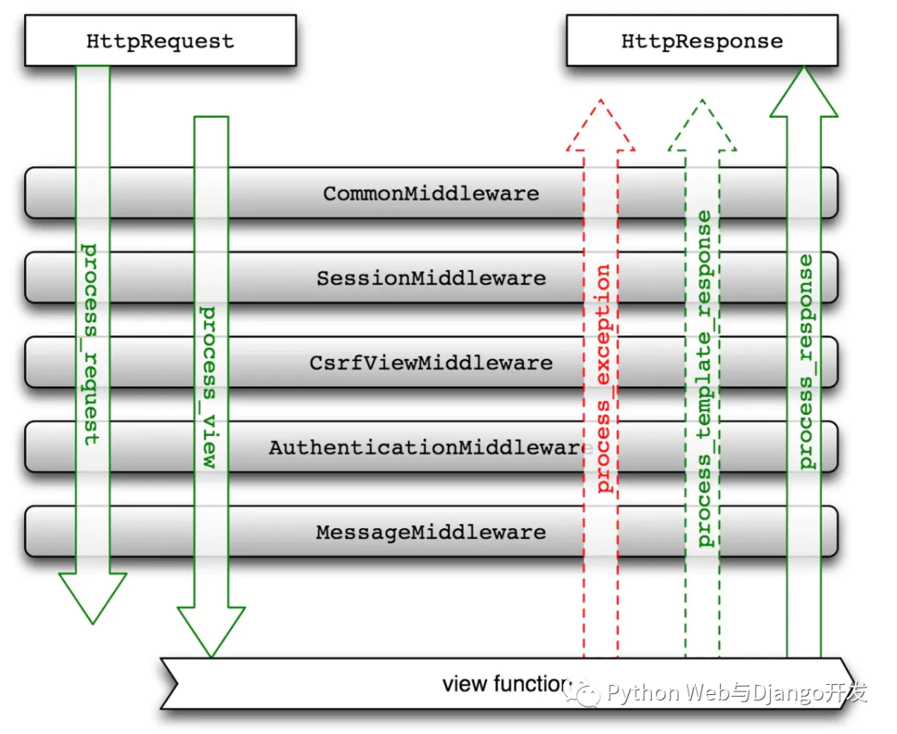

# Django 中间件

## 1.中间件写法
- 写法1:
    ```python
    def simple_middleware(get_response):
        ...  # 一次性配置和初始化
        def middleware(request):
            ...  # 在调用视图（和以后的中间件）之前，为每个请求执行的代码.
            response = self.get_response(request)
            ...  # 调用视图后将为每个请求/响应执行的代码.
            return response
        return middleware
    ```

- 写法2:
    ```python
    class SimpleMiddleware:
        def __init__(self, get_response):
            self.get_response = get_response
            ... # 一次性配置和初始化。

        # 每次请求调用
        def __call__(self, request):
            ...  # 在调用视图（和以后的中间件）之前，为每个请求执行的代码.
            response = self.get_response(request)
            ...  # 调用视图后将为每个请求/响应执行的代码.
            return response
    ```

> get_response 响应可能是实际视图（如果这是最后列出的中间件），或者它可能是链中的下一个中间件


## 2.激活中间件
- 在setting.py 的 MIDDLEWARE中:
    ```python
    MIDDLEWARE = [
        ...
        '注册你的中间件'
    ]
    ```


## 3.中间件顺序与分层


    在请求阶段，在调用视图之前，Django 按照定义的顺序应用中间件 MIDDLEWARE，自顶向下。

    你可以把它想象成一个洋葱：每个中间件类都是一个`层`，它覆盖了洋葱的核心。如果请求通过洋葱的所有层（每一个调用 get_response ）以将请求传递到下一层，一直到内核的视图，那么响应将在返回的过程中通过每个层（以相反的顺序）。

    如果其中一层决定停止并返回响应而不调用get_response，那么该层(包括视图)中的洋葱层都不会看到请求或响应。响应将只通过请求传入的相同层返回。


## 4.其他中间件钩子


### 1. process_view()
> 在调用视图前被调用

> process_view(request, view_func, view_args, view_kwargs)

- request 是一个 HttpRequest 对象。
- view_func 是一个 Django 将要使用的 Python 函数,(这是一个真实的函数对象,不是函数的名称)
- view_args 是一个用来传递给视图的位置参数列表
- view_kwargs 是一个用来传递给视图的关键字参数字典
- view_args 和 view_kwargs 都不包含第一个视图参数(request)


    它应该返回 None 或 HttpResponse 对象。如果它返回 None, Django 将继续处理这个请求, 执行任何其他的 process_view(), 然后执行相应的视图. 如果它返回 HttpResponse 对, Django 不会去响应调用相应的视图, 它会将响应中间件应用到 HttpResponse 并返回结果。

    `在视图运行前或在 process_view() 内访问中间件里的 request.POST 将阻止中间件之后运行的任何视图修改请求的上传处理程序 （modify the upload handlers for the request ），通常应该避免这样`


### 2.process_exception()
> process_exception(request, exception)

- request 是一个 HttpRequest 对象。 
- exception 是一个由视图函数引发的 Exception 对象。

    当视图引发异常时，Django 会调用 process_exception()。process_exception() 应该返回 None 或 HttpResponse 对象。如果它返回一个 HttpResponse 对象，模板响应和响应中间件将被应用且会将结果响应返回浏览器。否则，就会开始默认异常处理（ default exception handling )

    再次，中间件在响应阶段会按照相反的顺序运行，其中包括 process_exception 。如果异常中间件返回一个响应，那么中间件之上的中间件类的 process_exception 方法根本不会被调用


### 3.process_template_response()
> process_template_response(request, response)

- request 是一个 HttpRequest 对象。
- response 是 TemplateResponse 对象（或者等效对象），它通过 Django 视图或中间件返回。

    process_template_response() 在视图被完全执行后调用，如果响应实例有 render() 方法，表明它是一个 TemplateResponse 或等效对象。

    它必须返回一个实现了 render 方法的响应对象。它可以通过改变``response.template_name`` 和 response.context_data 来改变给定的 response ，或者它可以创建和返回全新的 TemplateResponse 或等效对象。

    你不需要显式地渲染响应——一旦所有模板中间件被调用，响应会被自动渲染。

    中间件会在响应阶段按照相反的顺序运行，其中包括 process_template_response()

## 5.异步支持
> New in Django 3.1.

> 中间件支持同步和异步请求的任意组合。如果Django不能同时支持它们，它会调整请求来适应中间件的需求，但会有性能损失

    默认情况下，Django假设你的中间件只能处理同步请求。如果要改变这种模式，需要在你的中间件工厂函数或类中添加入如下属性：

- `sync_capable` 是一个布尔值，来表明中间件是否处理同步请求。默认为 True。
- `async_capable` 是一个布尔值，来表明中间件是否处理异步请求。默认为 False。
  
    如果中间件的 `sync_capable = True` 并且 `async_capable = True`, 那么Django 会将请求传递给它而不进行转换。在这种情况下，你可以使用 asyncio.iscoroutinefunction() 来检查传递的 get_response 是否是一个协同函数，从而确定中间件是否接收到异步请求。

    `django.utils.decorators` 模块包含 `sync_only_middleware()`，`async_only_middleware()` 和 `sync_and_async_middleware()` 装饰器，允许你将这些标志应用到中间件工厂函数中。

    返回的可调用对象必须符合 `get_response` 方法的同步或异步性质。如果你有一个异步的 `get_response`,你必须返回一个协程函数（`async def`）。

    `process_view`、`process_template_response` 和 `process_exception` 方法，如果有的话，也应该进行调整以匹配同步／异步模式。然而，如果你不这样做，Django 会根据需要单独调整它们，但会有额外的性能损失。

    下面以一个例子来说明如何创建一个支持这两种功能的中间件函数：

    ```python
    import asyncio
    from django.utils.decorators import sync_and_async_middleware

    @sync_and_async_middleware
    def simple_middleware(get_response):
        # 一次性配置和初始化.
        if asyncio.iscoroutinefunction(get_response):
            async def middleware(request):
                ... # Do something here!
                response = await get_response(request)
                return response

        else:
            def middleware(request):
                # Do something here!
                response = get_response(request)
                return response

        return middleware
    ```